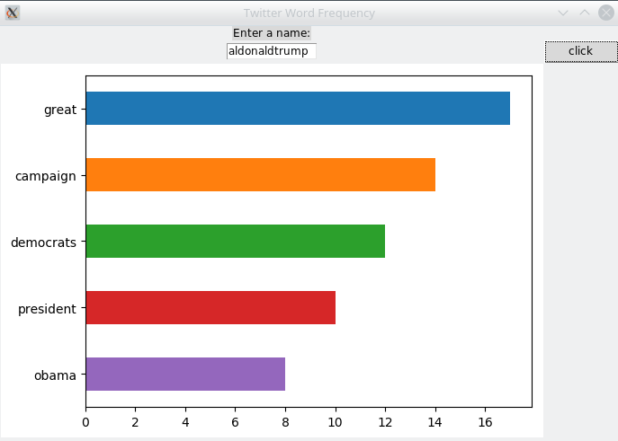

# cs_299
Twitter word frequency analysis

### Install

```bash
git clone https://github.com/jtara1/cs_299
cd cs_299
sudo pip3 install -r requirements.txt
```

### Run

$PWD should be the root directory of this repo

```bash
python3 run.py
```

### Usage

